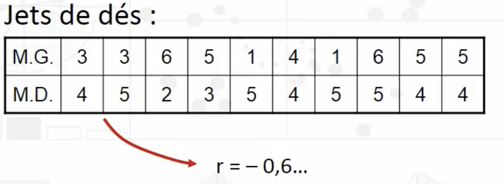

```{r}
str(smp)
cor(smp$age,smp$n.enfant,use="complete.obs")
```

*Exemple 1 :*

Ici : corrélation = 0.4\
Mais dans quelle mesure le hasard peut expliquer une telle corrélation ?

*Exemple 2 :*



**« p » est la probabilité que le hasard puisse expliquer à lui seul une différence au moins aussi importante que celle qui a été observée.**
