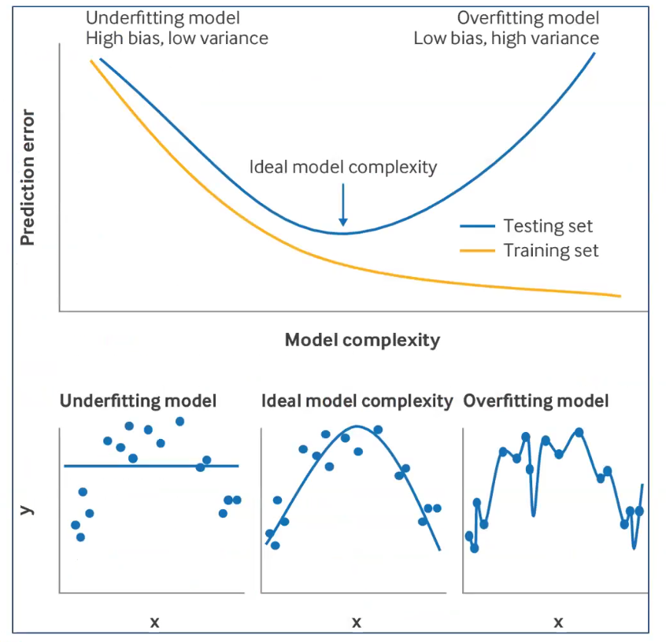
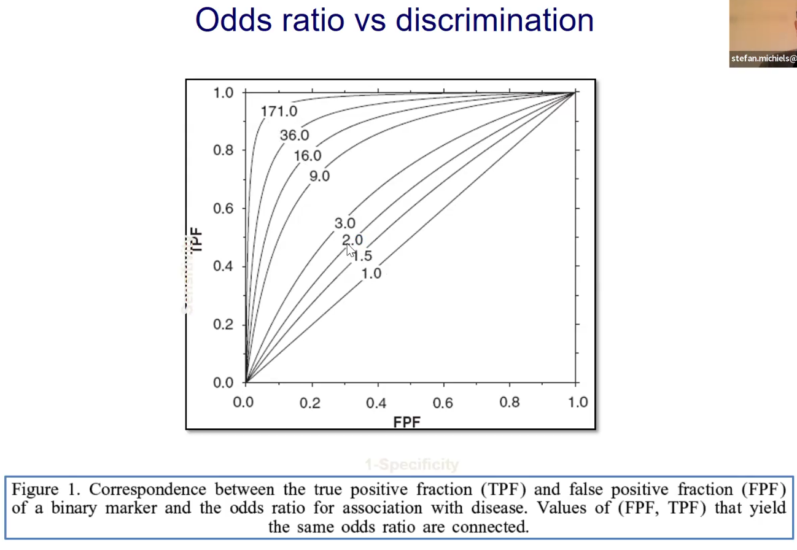
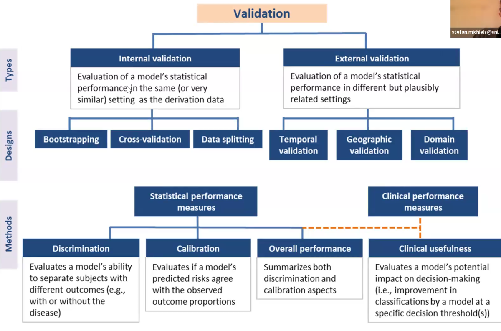
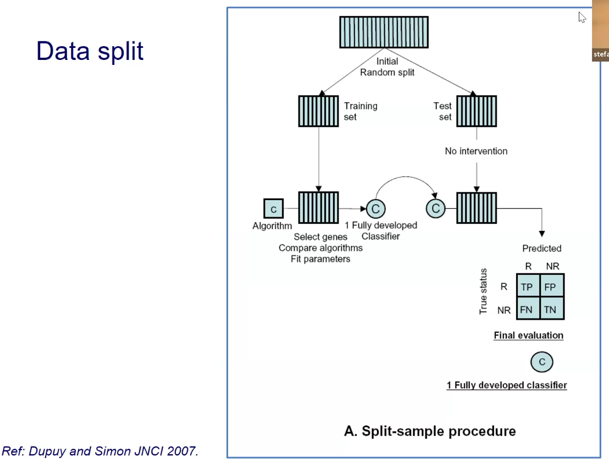
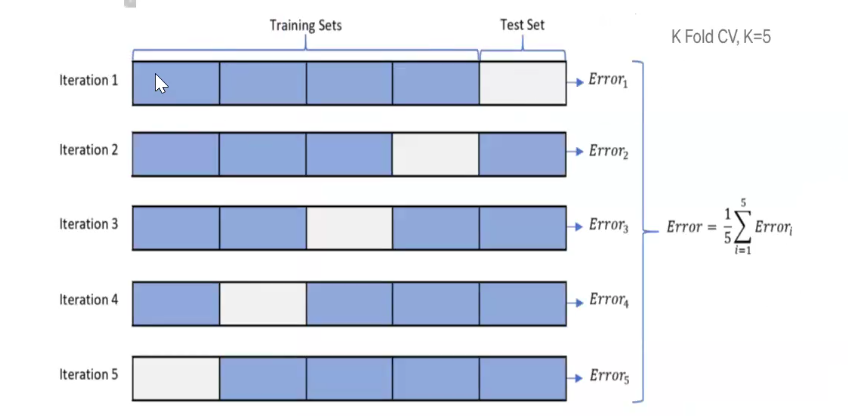
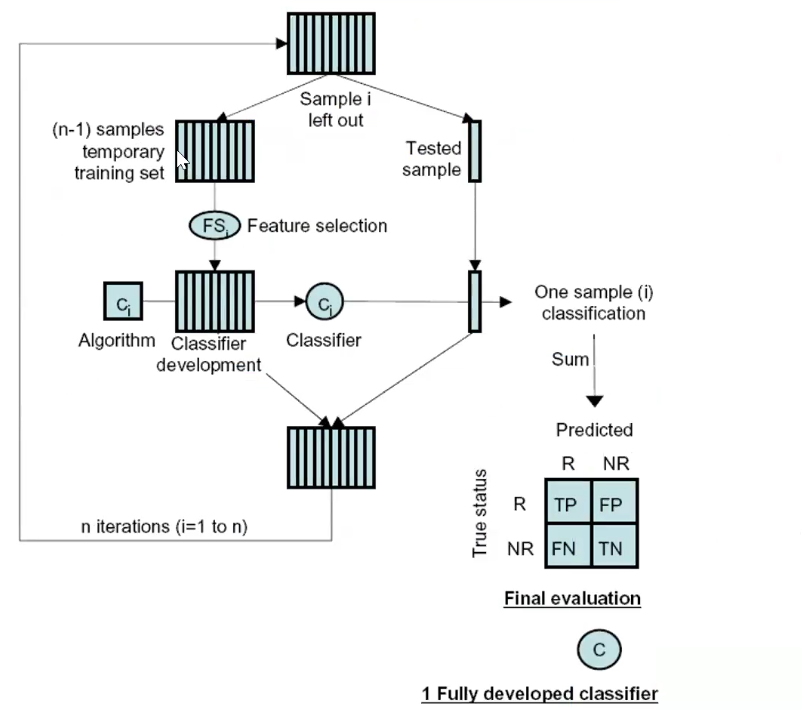
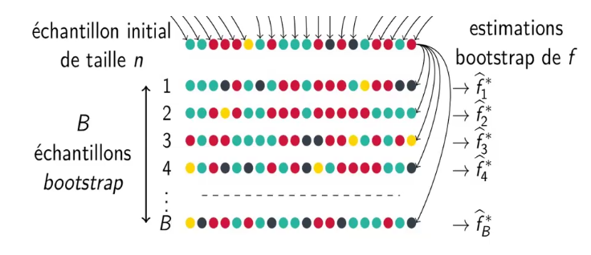
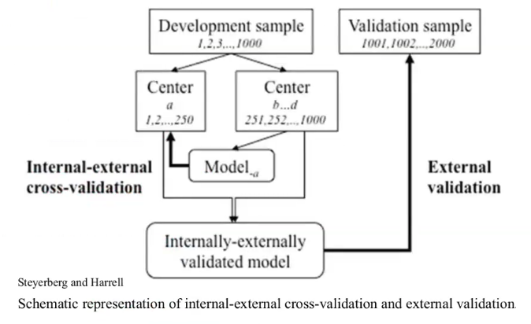
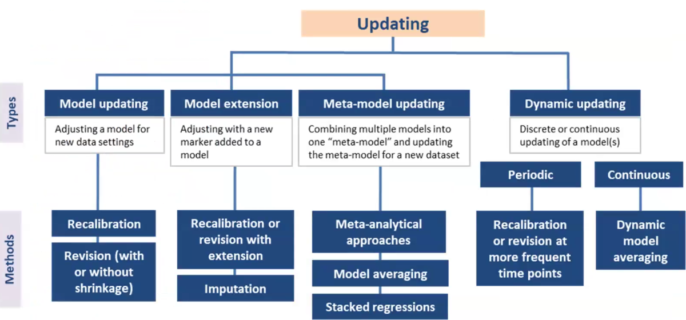
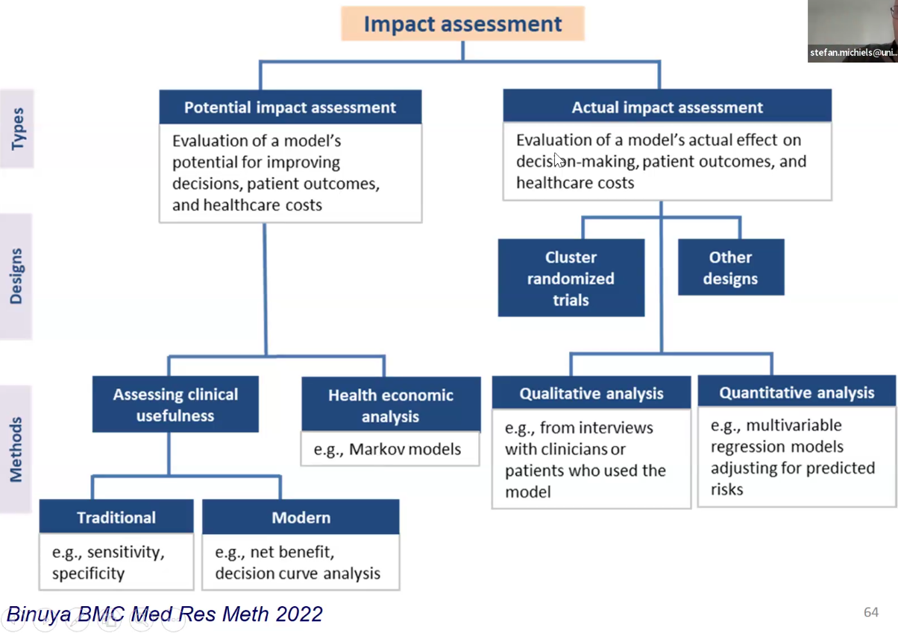

```{r}
#| label: setup
#| include: false
#| echo: false
library(forecast)
library(plotrix)
library(randomForest)
library(tidyr)
library(epiR)
library(DHARMa)
library(viridisLite)
library(ggplot2)
library(binom)
library(survminer)
library(pROC)
library(treemap)
library(boot)
library(psy)
library(MASS)
library(mgcv)
library(rpart)
library(logbin)
library(rpart.plot)
library(plotly)
library(lmerTest)
library(psych)
library(lme4)
library(prettyR)
library(kableExtra)
library(gtsummary)
library(dplyr)
library(lattice)
library(survey)
library(mice)
library(qgraph)
library(nlme)
library(pwr)
library(guideR)
library(ape)
library(survival)
library(gmodels)
library(httpgd)
library(e1071)
library(psy)
library(reshape2)
knitr::opts_chunk$set(echo = TRUE)
knitr::opts_chunk$set(fig.height = 6)
```

## Modèles de prédiction clinique

#### Utilité des facteurs pronostiques dans les modèles de prédiction clinique

-   Classification de la maladie au diagnostic

-   Prédiction de l’évolution de la maladie (risque absolu)

-   Informer la gestion clinique

-   Prévision individuelle plus précise du risque

-   Stratifier les patients dans les essais cliniques

#### Différents types de modèles de prédiction clinique

-   Modèles explicatifs : mettent en évidence les facteurs de risque et leur contribution à la maladie

-   Modèles prédictifs : se concentrent sur la précision de la prédiction, indépendamment de l’interprétabilité (pas de préoccupation au sujet de la causalité ou de la confusion)

-   Modèles descriptifs : résument les données sans nécessairement faire de prédictions

## Dévelopmment d'un modèle de prédiction clinique : étape par étape

1.  **Définir les objectifs et rédiger un protocole détaillé**

2.  **Choisir entre le développement d’un nouveau modèle ou la mise à jour d’un modèle existant**

3.  **Spécifier le critère de jugement principal (outcome)**

4.  **Lister les prédicteurs candidats et décrire leurs méthodes de mesure**

5.  **Déterminer la taille d’échantillon nécessaire**

6.  **Recueillir les données et vérifier leur qualité**

7.  **Traiter les données manquantes (imputation, exclusions justifiées, etc.)**

8.  **Ajuster les modèles de prédiction (développement ou mise à jour)**

9.  **Évaluer la performance des modèles : discrimination, calibration, utilité clinique**

10. **Comparer les modèles et sélectionner la version finale**

11. **Effectuer une analyse de la courbe décisionnelle pour estimer l’impact clinique**

12. **Rédiger et publier les résultats** (inclure, si pertinent, une analyse facultative de la contribution individuelle de chaque prédicteur)

#### Objectifs d'un modèle de prédiction clinique

-   Population cible : pour qui le modèle doit prévoir ?

-   Quel critère d'évaluation faut-il prévoir ?

-   Utilisateur : qui va utiliser le modèle ? (cliniciens, patients, systèmes de santé)

-   Décisions cliniques que le modèle doit informer (traitement, dépistage, suivi)

#### Choix entre développement d’un nouveau modèle ou mise à jour d’un modèle existant

-   Revue de la littérature pour identifier les modèles existants.

-   PROBAST : outil de validation critique pour évaluer la qualité méthodologique des modèles de prédiction existants (permet d’identifier les risques de biais et les problèmes de validité).

    -   Risques de biais : par ex overfitting, sélection des prédicteurs, gestion des données manquantes, etc.

    -   Applicabilité : évaluer si le modèle est pertinent pour la population cible, les prédicteurs disponibles, les critères d’évaluation, etc.

-   Pourquoi pas évaluer la validité d'un modèle existant dans la population cible avant de développer un nouveau modèle ?

-   Selon résultats de la validation, décider de développer un nouveau modèle ou de mettre à jour un modèle existant (ajout de nouveaux prédicteurs, recalibrage, etc.)

#### Définition d'un critère de jugement pour un modèle de prédiction clinique

-   Réponse binaire si temps bref ou simultanéité (ex. présence d’une maladie)

-   Réponse quantitative si état fonctionnel, qualité de vie, taille tumeur...

-   Etc etc

#### Détermination des prédicteurs possibles et préciser les méthodes de mesure pour un modèle de prédiction clinique

-   Prédicteurs : idéalement définis et mesurés objectivement, de manière fiable et reproductible, et disponibles au moment de la prise de décision clinique.

-   Dichotomosation / catégorisation des prédicteurs continus réduit l'information et la puissance statistique

#### Taille d’échantillon nécessaire pour développer un modèle de prédiction clinique

-   Règle empirique : au moins 10 événements par prédicteur (EPV) pour les modèles de régression logistique (ex. 100 événements pour 10 prédicteurs)

-   4 critères :

    -   Estimation de l'incidence

    -   Estimation des prédictions individuelles

    -   Pas trop de sur-ajustement (overfitting) (a posteriori ou lors de la modélisation (lasso, ridge, etc.))

    -   Corriger le sur-ajustement de manière un peu systématique

-   Référence : Riley et al. (2020) "Calculating the sample size required for developing a clinical prediction model" BMJ 368:m441. https://doi.org/10.1136/bmj.m441 [@riley2020]

#### Recueil des données et vérification de leur qualité pour un modèle de prédiction clinique

-   Idéal = cohorte prospective avec collecte de données standardisée

-   Mais difficiles à mettre en place, coûteuses, longues

-   Erreurs de données : essayer de standardiser

-   Exploration des données : prédicteur avec faible variabilité dans le jeu de données ? Mutation avec fréquence faible ? Prédicteur avec beaucoup de données manquantes ? Etc.

#### Modèles de prédiction : Adaptation des modèles

-   Si taille grande : termes non linéaires (eg splines), interactions

    -   splines : permettent de modéliser des relations non linéaires entre les prédicteurs continus et l'outcome sans imposer une forme fonctionnelle spécifique (ex. linéaire). Ils divisent la plage des prédicteurs en segments et ajustent des fonctions polynomiales dans chaque segment, assurant une transition fluide entre eux.

-   Modèles IA / machine learning : random forest, gradient boosting, réseaux de neurones, etc.

-   Mais première étape : **pénalisation** de modèles (avant de passer à des modèles plus complexes) : lasso, ridge, elastic net, etc.

-   Dans tous les cas : vérifier les hypothèses des modèles :

    -   Modèle linéaire général :

        -   Indépendance des résidus

        -   Homoscédasticité (variance constante des résidus)

        -   Normalité des résidus

    -   Linéaritié (pour les prédicteurs continus)

    -   Additivité = absence d’interactions (sauf si spécifiées)

    -   Survie : proportionalité des risques (Cox), etc.

#### Modèles de prédiction clinique : Étude de l'adéquation du modèle

-   Processus diagnostique ou utilisation des résidus pour évaluer les hypothèses du modèle :

    -   Résidus vs prédictions ajustées

    -   Résidus vs prédicteurs (résidus = écarts entre valeurs observées et valeurs prédites en fonction de chaque prédicteur)

    -   Q-Q plot des résidus

#### Modèles de prédiction clinique : transformation des variables

-   Le fait d'exprimer au mieux la relation avec la réponse nécessite parfois une transformation

-   Ou pour **respecter les conditions du modèle**

-   Recherche du seuil optimal, de segmentation (arbre de régression)

-   Splines / polynomes : modèles de régression locale pour interaction complexe entre deux variables

#### Modèles de prédictions cliniques : AIC et BIC

-   2 façons de "fit" des modèles différentes

-   **Aikake Information Criteria (AIC)**

    -   calculée à partir de la vraisemblance du modèle et du nombre de paramètres qu'il utilise

    -   Pénalise les modèles plus complexes (avec plus de paramètres) pour éviter le sur-ajustement (overfitting)

    -   Le modèle avec le plus petit AIC est considéré comme le meilleur compromis entre la qualité de l'ajustement et la simplicité du modèle

-   **Bayesian Information Criterion (BIC)**

    -   **Tient compte du nombre d'observations dans le calcul de la pénalisation, ce qui peut conduire à une préférence pour des modèles plus simples lorsque la taille de l'échantillon est grande**

    -   Très proche de l'AIC, mais pénalise davantage les modèles avec plus de paramètres (plus strict que l'AIC)

    -   Le modèle avec le plus petit BIC est considéré comme le meilleur compromis entre la qualité de l'ajustement et la simplicité du modèle, mais avec une pénalisation plus forte pour les modèles complexes que l'AIC

#### Modèles de prédiction clinique : conséquences d'erreur de sélection de prédicteurs

-   Fausse inclusion d'une variable prédictive

-   Fausse exclusion d'une variable prédictive

-   Dans les deux cas : problème d'estimation de la variance des prédictions (RMSE)

-   Et si variable importante : **biais** dans la prédiction, donc biais dans la prédiction

#### Modèles de prédiction clinique : différents procédés de sélection des variables

-   **Procédures pas à pas (*stepwise*) :**

    -   Ascendante : forward ou bottom-up

    -   Descendante : backward ou top-down

    -   On peut utiliser des critères comme AIC ou BIC pour choix

    -   Mais biais ++ !! car pas de test pour l'incertitude dans le processus de sélection des variables

        -   $R^2$ (RMSE) tiré vers le haut car les variables sont sélectionnées pour maximiser la performance du modèle sur les données d'entraînement, ce qui peut conduire à un sur-ajustement (overfitting) et à une performance surestimée du modèle sur ces données

        -   Tests statistiques non conformes car les tests sont effectués sur un modèle sélectionné à partir des données d'entraînement, ce qui introduit un biais dans les tests statistiques

        -   variance des coefficients biaisées vers le bas (IC bas)

        -   degré de significativité trop bas, car comparaisons multiples

        -   sélection dépend de la colinéarité des variables incluses

    -   NB : dans un modèle, RMSE correspond à la somme de la variance des prédictions (imprécision) et du biais (erreur systématique).

    -   Si R2 est tiré vers le haut, ça veut dire que le modèle est "suroptimiste" : il prédit mieux les données d'entraînement que les données de test (ou de validation)

-   **Modèle complet**

    -   Chaque variable est incluse dans le modèle, indépendamment de sa significativité statistique

    -   Une variable hautement corrélée avec la réponse peut avoir une contribution négligeable car son effet est déjà capturé par d'autres variables incluses dans le modèle

-   **Modèle "expert"** : sélection basée sur la littérature, l'expertise clinique, etc.

-   **Modèle hiérarchique** :

    -   groupement "naturel" de variables par domaine,

    -   puis sélection dans chaque domaine,

    -   puis sélection finale à partir des variables retenues dans chaque domaine

#### Modèles de prédiction clinique : définition et conséquences de la multicolinéarité

-   1 prédicteur peut être prédit à partir des autres

-   Lorsque les prédicteurs sont fortement corrélés entre eux, il peut être difficile de déterminer l'effet individuel de chaque prédicteur sur la variable de réponse, ce qui peut entraîner des coefficients instables et difficiles à interpréter dans les modèles de régression.

-   La multicolinéarité peut également conduire à des erreurs d'estimation des coefficients, à une augmentation de la variance des prédictions (RMSE) et à une diminution de la significativité statistique des prédicteurs, rendant ainsi le modèle moins fiable pour la prise de décision clinique.

-   Variance Inflation Factor :

    -   quantifie la multicolinéarité en passant par une régression du facteur en question sur les autres,

    -   indique dans quelle mesure la variance d'un coefficient de régression est augmentée en raison de la corrélation avec les autres prédicteurs.

    -   Un VIF élevé (généralement \> 5 ou 10) suggère une multicolinéarité problématique, ce qui peut rendre les coefficients de régression instables et difficiles à interpréter.

#### Modèles de prédiction clinique : parcimonie vs performance

-   Modèle parcimonieux : modèle qui utilise le moins de prédicteurs possible, au risque d'être "underfitting"

-   Modèle performant : modèle qui maximise la performance (ex. R2, RMSE, etc.) sans nécessairement se soucier du nombre de prédicteurs utilisés

-   Il existe souvent un compromis entre parcimonie et performance : un modèle plus simple peut être plus facile à interpréter et à utiliser en clinique, mais peut avoir une performance légèrement inférieure à un modèle plus complexe. Inversement, un modèle plus complexe peut offrir une meilleure performance, mais peut être plus difficile à interpréter et à appliquer en pratique clinique.

-   Plus on ajuste le modèle sur les données d'entraînement, plus le risque est de s'éloigner des données de test.

-   Ajuster = dépenser des degrés de liberté



#### Modèle de prédiction clinique : éviter le surajustement

-   Principe général de parcimonie (Occam) : préférer le modèle le plus simple qui explique les données

-   Principes de réduction :

    -   Éliminer les variables non retrouvées dans la littérature

    -   Éliminer variables de distribution trop proches ou avec fortes proportion de données manquantes

-   Méthodes pour limiter le surajustement :

    -   réduction de dimension / sélection de variables : composantes principales, *partial least squares* (PLS), LASSO (*Least Absolute Shrinkage and Selection Operator*), etc.

    -   shrinkage/pénalisation des coefficients : régression ridge, elastic net, lasso, etc.

#### Modèles de prédiction clinique : décomposition biais-variance de l'erreur de prédiction

-   L'erreur de prédiction (RMSE) peut être décomposée en deux composantes : le biais et la variance.

-   **Biais** = écart au carré entre l'espérance de la prédiction et la vraie valeur. Correspond à l'erreur systématique (au carré) dans les prédictions du modèle, c'est-à-dire la différence entre les prédictions moyennes du modèle et les valeurs réelles de la variable de réponse. Un modèle avec un biais élevé a tendance à faire des prédictions qui sont systématiquement éloignées des valeurs réelles.

-   **Variance** = dispersion de la prédiction autour de sa propre espérance. Correspond à la variabilité des prédictions du modèle pour différents échantillons de données d'entraînement. Un modèle avec une variance élevée a tendance à faire des prédictions qui varient considérablement en fonction des données d'entraînement utilisées, ce qui peut conduire à un sur-ajustement (overfitting) et à une performance médiocre sur les données de test.

-   NB : ici, *espérance* = valeur moyenne théorique de la prédiction quand on répète le même processus d'apprentissage plusieurs fois.

    -   Concrètement : on imagine ré-échantillonner les données d'entraînement (ou répéter l'étude), ré-ajuster le modèle à chaque fois, puis calculer la prédiction pour un même patient/profil $x$.

    -   L'espérance $\mathbb{E}[\hat{y}(x)]$ est alors la moyenne des prédictions $\hat{y}(x)$ obtenues sur ces répétitions (source d'aléa = choix de l'échantillon et, selon le contexte, le bruit de mesure).

#### Modèles de prédiction clinique : shrinkage (rétrécissement des coefficients)

-   **Définition** : le *shrinkage factor* $S$ (souvent $0 < S \\le 1$) sert à **réduire l'amplitude** des coefficients d'un modèle.

-   **Problème visé** : en cas de **surajustement** (trop de degrés de liberté pour une taille d'échantillon limitée), les coefficients sont souvent **surestimés**, ce qui produit des prédictions **trop extrêmes** et trop optimistes sur de nouvelles données (typique : *calibration slope* \< 1).

-   **Principe** : appliquer une réduction globale des coefficients (en général **hors intercept**) :

    -   $\beta^{*} = S\,\hat{\beta}$

    -   Effet : les prédictions se rapprochent de la moyenne (moins extrêmes), donc en général une calibration plus réaliste.

-   **Comment obtenir** $S$ ? (réduction *a posteriori*) : estimer l'optimisme par **validation interne** (souvent *bootstrap*), puis utiliser une estimation du *calibration slope* **corrigé de l'optimisme** comme facteur de shrinkage global.

-   **Exemple** : si $S = 0{,}9$, alors on multiplie chaque $\hat{\beta}$ (hors intercept) par $0{,}9$ : on « retire » \~10% à tous les effets.

#### Modèles de prédiction clinique : Pénalisation

-   **Régression ridge**

    -   Objectif : réduire la variance des coefficients de régression en ajoutant une pénalité à la somme des carrés des coefficients

    -   Pénalité : la pénalité est proportionnelle au carré des coefficients

    -   Effet : réduit la magnitude des coefficients mais ne les annule pas

-   **Régression LASSO**

    -   Objectif : Sélectionner les variables les plus importantes en ajoutant une pénalité à la somme des valeurs absolues des coefficients

    -   Pénalité : la pénalité est proportionnelle à la valeur absolue des coefficients

    -   Effet : peut annuler certains coefficients, effectuant une sélection des variables

-   **Elastic net** :

    -   Combine Ridge et Lasso

#### Modèle de prédiction clinique : stabilité des prédicteurs

-   La sélection des variables introduit généralement une incertitude supplémentaire

    -   Instabilité de la sélection

    -   Variance supplémentaire des coefficients de régression

-   Quantifier cette incertitude en utilisant des études de stabilité par ré-échantillonnage

    -   Répéter l'algorithme de sélection dans les sous-échantillons

    -   Attention : prédicteurs corrélés peuvent "jouer à cache-cache"

-   Article : Table 2 de Heinze Biom J 2018 donne description de la sélection des variables et critères d'arrêt

#### Modèle de prédiction clinique : "Machine Learning"

-   Sur revue systématique : pas de performance de bénéfice par rapport aux régressions classiques

-   (Si articles classés en fonction de leur risque de biais)

#### Modèle de prédiction clinique : traitement des données manquantes

-   Imputation multiple des prédicteurs

-   2 articles : Vergouwe 2010 [@vergouweDevelopmentValidationPrediction2010] ; Janssen 2009 [@janssenDealingMissingPredictor2009]

#### Modèle de prédiction clinique : évaluation de la performance

-   Exemple : régression logistique

    -   **Discrimination** : capacité du modèle à différencier les patients "malades" et "sains" (ex. AUC, c-statistic)

    -   **Calibration** :

        -   **concordance** entre les probabilités prédites et les probabilités observées (ex. courbe de calibration, test de Hosmer-Lemeshow)

        -   **biais** : différence entre moyenne des probabilités prédites et moyenne des probabilités observées

    -   **Mesures globales** :

        -   $R^2$ de Nagelkerke : proportion de la variance expliquée par le modèle, entre 0 et 1. Plus le $R^2$ est proche de 1, meilleure est la performance du modèle. Cependant, il peut être influencé par la complexité du modèle et le nombre de prédicteurs inclus.\
            (*"à maximiser"* : veut dire que plus le R2 est élevé, meilleure est la performance du modèle)

        -   **Brier score** : mesure de la moyenne des carrés des écarts entre les probabilités prédites et les résultats observés (0 ou 1). Un Brier score plus bas indique une meilleure performance du modèle.\
            (*"à minimiser"* : veut dire que plus le Brier score est bas, meilleure est la performance du modèle)

    -   **Utilité clinique** : évaluation de l'impact du modèle sur la prise de décision clinique (ex. courbe décisionnelle, analyse de l'impact clinique)

#### Modèle de prédiction clinique : rapport entre OR et discrimination



#### Modèle de prédiction clinique : calibration

-   = Distribution des probabilités prédites vs distribution des probabilités observées

-   Exemple : soit un échantillon avec 30% de décès

    -   Un modèle prédit $P(\text{décès})$

        -   = 0,1 pour tous ceux qui vivent

        -   = 0,2 pour tous ceux qui décèdent

        -   = mal calibré car prédiction moyenne = $0,1 \times 0,7 + 0,2 \times 0,3 = 0,13 < 0,3$

    -   Un autre modèle prédit $P(\text{décès})$

        -   = 0 à 0,5 pour ceux qui vivent

        -   = 0,2 à 1 pour ceux qui décèdent

        -   = bien calibré car prédiction moyenne = $0,25 \times 0,7 + 0,6 \times 0,3 = 0,3$

-   Rapport O/E : rapport $\frac{\text{nb évènements observés}}{\text{nb évènements prédits}}$

    -   O/E = 1 : calibration parfaite

    -   O/E \< 1 : sur-prédiction (trop d'évènements prédits)

    -   O/E \> 1 : sous-prédiction (pas assez d'évènements prédits)

-   Mais analyse par sous-groupe nécessaire pour évaluer la calibration à différents niveaux de risque

    -   Exemple : pour 1000 sujets, 10% de décès

        -   Le modèle prédit 10% pour tout le monde : O/E = 1

        -   Mais 500 graves : 15% de décès : O/E = 1,5 (sous-prédiction)

        -   500 légers : 5% de décès : O/E = 0,5 (sur-prédiction)

-   3 composantes de la calibration :

    -   **Biais** (*calibration-in-the-large*) :

        -   C'est quoi ? Un décalage “global” : le modèle prédit en moyenne trop haut ou trop bas.

        -   Comment le lire ? différence entre la **moyenne des probabilités prédites** et la **proportion observée** d'évènements (prévalence).

        -   Lien avec les termes : *in-the-large* correspond à l'**intercept** de la droite de calibration (si tout est trop haut/bas, c'est l'intercept qui bouge).

    -   **Accélération** (*calibration slope*, la **pente / slope**) :

        -   C'est quoi ? La pente mesure si les prédictions sont **trop extrêmes** ou **pas assez extrêmes**.

        -   *Slope* \< 1 : prédictions trop extrêmes (souvent surajustement) → hauts risques surestimés, bas risques sous-estimés.

        -   *Slope* \> 1 : prédictions pas assez extrêmes (effets trop faibles).

    -   **Erreur** (reste d'écart après biais + pente) :

        -   C'est quoi ? Même après avoir corrigé un **intercept** (biais) et une **pente** (accélération), il peut rester des écarts selon le niveau de risque.

        -   Sur un graphique : la courbe “observé vs prédit” n'est pas parfaitement alignée sur une droite.

-   Courbe de calibration : **biais = intercept** ; **accélération = pente (slope)**.

-   Calibration parfaite : **intercept = 0** et **pente (slope) = 1**.

#### Modèle de prédiction clinique : calibration vs discrimination

-   Pas 100% compatibles

-   Calibration : concordance entre les probabilités prédites et les probabilités observées

-   Discrimination : capacité du modèle à différencier les patients "malades" et "sains"

-   Différence : un modèle peut être bien calibré (prédictions moyennes proches de la réalité) mais avoir une mauvaise discrimination (ne pas différencier les patients à haut risque des patients à bas risque), ou inversement, un modèle peut avoir une bonne discrimination (bien différencier les patients à haut risque des patients à bas risque) mais être mal calibré (prédictions moyennes éloignées de la réalité).

-   **Privilégier la discrimination dans le développement du modèle** : la calibration peut être corrigée a posteriori (recalibrage), mais la discrimination est plus difficile à améliorer après coup.

-   Amélioration de la calibration en modifiant l'intercept (ou le risque de base) et éventuellement par "shrinkage" des paramètres

-   La discrimination peut être améliorée en ajoutant de nouveaux prédicteurs,

    -   "Mise à jour" d'un modèle existant : ajout de nouveaux prédicteurs, recalibrage, etc.

    -   Le modèle mis à jour nécessite une validation externe supplémentaire pour évaluer sa performance dans une nouvelle population.

#### Modèle de prédiction clinique : validation interne / externe

-   Validation INTERNE

    -   Sur le même échantillon que celui utilisé pour développer le modèle

        -   Rééchantillonnage : rééchantillonnage avec remplacement pour estimer l'optimisme du modèle

            -   Bootstrap : créer de nombreux échantillons bootstrap (ex. 1000) en rééchantillonnant avec remplacement, ajuster le modèle sur chaque échantillon bootstrap, puis évaluer la performance du modèle sur les données d'origine pour estimer l'optimisme.

            -   Jackknife : créer des échantillons en retirant un individu à la fois, ajuster le modèle sur chaque échantillon réduit, puis évaluer la performance du modèle sur les données d'origine pour estimer l'optimisme.

        -   Cross-validation : division de l'échantillon en k sous-échantillons, entraînement du modèle sur k-1 sous-échantillons et test sur le sous-échantillon restant, répété k fois

        -   Data splitting : division de l'échantillon en un ensemble d'entraînement et un ensemble de test, entraînement du modèle sur l'ensemble d'entraînement et évaluation de la performance sur l'ensemble de test

    -   Objectif : évaluer la performance du modèle sur les données d'entraînement et estimer l'optimisme (sur-ajustement)

-   Validation EXTERNE

    -   Sur un échantillon différent de celui utilisé pour développer le modèle, idéalement dans une population différente

        -   Validation temporelle : utiliser des données collectées à un moment différent

        -   Validation géographique : utiliser des données collectées dans un lieu différent

        -   Validation par centre : utiliser des données collectées dans un centre différent



#### Modèle de prédiction clinique : validation interne par data splitting

-   Diviser l'échantillon en un ensemble d'entraînement (ex. 70-80%) et un ensemble de test (ex. 20-30%)

-   Entraîner le modèle sur l'ensemble d'entraînement

-   Évaluer la performance du modèle sur l'ensemble de test

-   Avantages : simple à mettre en œuvre, rapide

-   Inconvénients : peut être instable (dépend du choix de la division), moins efficace que le bootstrap ou la cross-validation pour estimer l'optimisme du modèle

-   Nécessite une taille d'échantillon suffisante pour que les ensembles d'entraînement et de test soient représentatifs



#### Modèle de prédiction clinique : validation interne par cross-validation

-   **Principe (k-fold cross-validation)** : on découpe l'échantillon en $k$ **partitions** (ou *folds*) d'effectifs similaires (souvent $k=5$ ou $k=10$).

-   **À chaque itération** :

    -   on garde 1 partition comme **partie mineure** (*validation fold*, servant de test),

    -   et les $k-1$ autres partitions forment la **partie majeure** (*training folds*, servant d'entraînement).

-   On **répète** $k$ fois : chaque partition sert une fois de partie mineure (test), et $k-1$ fois de partie majeure (apprentissage).

-   **Ce qu'on évalue** : on calcule, à chaque itération, la performance sur la partie mineure (ex. AUC/C-index, Brier score, *calibration slope*), puis on **moyenne** (ou médiane) ces performances sur les $k$ itérations.

-   **Pourquoi c'est utile (optimisme)** :

    -   la performance “apparente” (évaluer sur les mêmes données que l'entraînement) est **optimiste** ;

    -   la cross-validation donne une estimation **moins optimiste** car la partie mineure n'a pas servi à ajuster le modèle.

-   **Lien avec le shrinkage factor** :

    -   en pratique, un *calibration slope* estimé en validation interne (dont k-fold) peut servir d'estimation d'un **global shrinkage factor** $S$ ;

    -   si $S<1$, cela suggère un surajustement → on peut envisager de “shrink” les coefficients (réduire leur amplitude) pour corriger l'optimisme.

-   **Avantages** : plus stable qu'un simple *data splitting* et utilise mieux les données (chaque observation sert à l'entraînement et au test).

-   **Inconvénients** : plus long/complexe ; et il faut éviter les fuites d'information (toutes les étapes du pipeline doivent être refaites dans la partie majeure : sélection de variables, imputation, standardisation, etc.).

-   **Pré-requis** : taille d'échantillon suffisante pour que les partitions soient représentatives (sinon la variance des estimations augmente).



#### Modèle de prédiction clinique : validation interne par leave-one-out cross-validation (LOOCV)

-   **Principe (LOOCV)** : c'est une k-fold cross-validation avec $k=n$.

    -   On crée $n$ **partitions** : chaque partition (= **partie mineure**) contient **1 seul individu**.

    -   La **partie majeure** contient les $n-1$ autres individus.

-   **À chaque itération** : on ajuste le modèle sur la partie majeure ($n-1$ sujets) et on prédit/évalue sur la partie mineure (1 sujet). On répète pour chacun des $n$ sujets.

-   **Ce qu'on obtient à la fin** : une prédiction “hors-apprentissage” pour chaque sujet (chacun a servi une fois de partie mineure). On peut alors calculer une performance globale (AUC/C-index, Brier, etc.).

-   **Optimisme** : comme l'évaluation se fait toujours sur des sujets non utilisés pour ajuster le modèle, la performance estimée est en général **moins optimiste** que la performance apparente.

-   **Avantages** : utilisation très efficace des données (partie majeure = $n-1$) et estimation de l'erreur de prédiction souvent **peu biaisée**.

-   **Inconvénients** : très coûteux (on ajuste $n$ fois) et peut avoir une estimation de performance **variable/instable** ; pas idéal si le pipeline est lourd (imputation, sélection de variables, etc.) car tout doit être refait dans chaque partie majeure.



#### Modèle de prédiction clinique : K-fold cross-validation vs LOOCV

-   **Quand** $k$ augmente (de $k=2$ vers $k=n$) :

    -   la **partie majeure** (ensemble d'entraînement) devient **plus grande** et les ensembles d'entraînement se **recouvrent davantage** entre itérations ;

    -   la **partie mineure** (ensemble de test) devient **plus petite**.

-   **K-fold cross-validation** (*ex.* $k=5$ ou $k=10$) :

    -   **Avantage principal** : **variance plus faible** de l'estimation de l'erreur de prédiction que la LOOCV (résultats souvent plus stables).

    -   **Inconvénient principal** : **biais lié à la taille de la partie majeure** (plus petite que $n$) → tendance à **surestimer l'erreur de prédiction** (estimation un peu pessimiste), surtout si $k$ est petit.

-   **LOOCV** (*leave-one-out,* $k=n$) :

    -   **Avantage principal** : utilisation “maximale” des données à chaque ajustement (partie majeure = $n-1$) → estimation de l'erreur de prédiction **peu biaisée** (mais pas nécessairement la meilleure en termes de variance).

    -   **Inconvénients principaux** : **très coûteux** (on ajuste $n$ modèles) et **variance élevée** (estimation plus instable).

-   NB :

    -   Erreur = biais + variance

    -   Biais = écart entre l'espérance de la prédiction et la vraie valeur

    -   Variance = dispersion de la prédiction autour de sa propre espérance

-   En résumé :

    -   **K-fold cross-validation** :

        -   donne en général une estimation **plus stable** (= varie moins si on refait le découpage / l’échantillonnage), car l’évaluation se fait sur des parties mineures plus “grosses”.

        -   En contrepartie, comme la partie majeure est plus petite que $n$, l’erreur peut être **un peu surestimée** (pessimiste), surtout si $k$ est petit.

    -   **LOOCV (**$k=n$) :

        -   donne souvent une estimation **peu biaisée** (= pas systématiquement trop haute/trop basse), car la partie majeure est presque tout l’échantillon ($n-1$).

        -   En contrepartie, l’estimation est souvent **moins stable** (= variance plus élevée) et **coûteuse** (on ajuste $n$ modèles).

#### Modèle de prédiction clinique : validation interne par rééchantillonnage (jackknife, bootstrap)

-   **Jackknife** : on crée $n$ échantillons en retirant un individu à la fois, on ajuste le modèle sur chaque échantillon réduit (SANS REMISE), puis on évalue la performance du modèle sur les données d'origine pour estimer l'optimisme.

-   **Bootstrap** : on crée de nombreux échantillons bootstrap (ex. 1000) en rééchantillonnant avec remplacement, on ajuste le modèle sur chaque échantillon bootstrap, puis on évalue la performance du modèle sur les données d'origine pour estimer l'optimisme.

-   **Objectif** : estimer l'optimisme du modèle (sur-ajustement) en comparant la performance sur les échantillons bootstrap à la performance sur les données d'origine.

-   **Avantages** : permet d'estimer de façon non paramétrique :

    -   l'optimisme du modèle (sur-ajustement) et le biais d'optimisme (= différence entre la performance apparente et la performance corrigée de l'optimisme)

    -   les intervalles de confiance pour les estimateurs de performance (ex. AUC, Brier, etc.)

-   **Déduire un shrinkage factor global (rééchantillonnage bootstrap)** :

    -   On estime un *calibration slope* **corrigé de l'optimisme** via le bootstrap (idée : ce slope mesure à quel point les prédictions sont trop extrêmes à cause du sur-ajustement).

    -   Ce slope corrigé peut être utilisé comme **facteur de shrinkage global** $S$.

    -   On applique ensuite le shrinkage aux coefficients (en général hors intercept) : $\beta^{*} = S\,\hat{\beta}$, ce qui rend les prédictions moins extrêmes et améliore la calibration sur de nouvelles données.



#### Modèle de prédiction clinique : validation interne-externe



-   Faisable si cohorte multicentrique

-   Validation **indispensable** pour utiliser un nouveau modèle

-   Pour validation interne : **bootstrap** souvent recommandé (ou cross-validation)

-   Utiliser le modèle corrigé pour son "optimisme" (shrinkage) par un facteur de réduction (coefficients, mesures de performance, etc.)

-   Validation externe (différent espace-temps de l'échantillon d'entraînement) = la meilleure !

-   Article CRASH-2 @perelPredictingEarlyDeath2012

#### Modèle de prédiction clinique : mise à jour d'un modèle de prédiction clinique

-   **Mise à jour (updating)** = adapter un modèle existant quand il est appliqué à un **nouveau contexte** (autre population, autre période, autres pratiques/mesures), afin de réduire la perte de performance (souvent : mauvaise calibration) et limiter l'optimisme.

-   **4 grands types de mise à jour**

    -   **Model updating** : ajuster le modèle à un nouveau jeu de données.

        -   **Recalibration (recalibrage)** : modifier le **risque de base** (intercept) et/ou la **pente** (slope) sans changer les prédicteurs.

        -   **Revision (révision)** : ré-estimer certains coefficients, avec ou sans **shrinkage factor** (rétrécissement global) pour corriger le sur-ajustement.

    -   **Model extension** : ajouter un **nouveau marqueur/prédicteur** à un modèle existant.

        -   Recalibrage ou révision **avec extension** (on conserve la structure initiale mais on ajoute un prédicteur).

        -   **Imputation** : si un prédicteur du modèle initial manque dans les nouvelles données, on peut parfois l'imputer (avec prudence) plutôt que supprimer le modèle.

    -   **Meta-model updating** : combiner plusieurs modèles en un **méta-modèle** puis l’actualiser sur un nouveau jeu de données.

        -   **Approches méta-analytiques** (combiner les informations issues de plusieurs études/modèles).

        -   **Model averaging** (moyennage de modèles).

        -   **Stacked regressions** (empilement : combinaison pondérée/apprise de plusieurs modèles).

    -   **Dynamic updating** : mettre à jour le(s) modèle(s) au cours du temps.

        -   **Périodique** : recalibrage/révision à des temps plus fréquents (par “lots” de données).

        -   **Continue** : mise à jour en continu, par ex. **dynamic model averaging** (moyennage dynamique des modèles).

-   **À retenir** : toute mise à jour doit être **(re)validée** (au minimum validation interne, idéalement externe) dans la population cible après modification.



#### Modèle de prédiction clinique : décider du modèle final

-   Choisir le modèle final en fonction des mesures de la performance de validation interne et interne-externe (et éventuellement sur les évaluations de stabilité des prédicteurs)

-   Si différentes stratégie fonctionnent de la même façon, privilégier la stratégie la plus simple (parcimonie ou rasoir d'Occam)

#### Modèle de prédiction clinique : effectuer une analyse de la courbe décisionnelle

-   Conséquences cliniques d'utiliser le modèle pour prendre des décisions (ex. traitement vs pas de traitement)

-   Courbe décisionnelle : évaluer le **bénéfice net** d'utiliser le modèle à différents seuils de décision (ex. probabilité de décès à partir de laquelle on décide de traiter)

-   Bénéfice net = (vrais positifs - faux positifs) / nombre total de patients, pondéré par le rapport entre les coûts/risques des faux positifs et des vrais positifs.

-   Permet de comparer le modèle à des stratégies alternatives (ex. traiter tout le monde, ne traiter personne) et d'identifier les seuils de décision où le modèle apporte un bénéfice net positif.

#### Modèle de prédiction clinique : évaluer l'impact clinique d'un modèle de prédiction

-   **Évaluation de l'impact clinique** : au-delà de la discrimination/calibration, on cherche à savoir si l'utilisation du modèle **améliore réellement** la prise de décision, les résultats patients et/ou les coûts.

-   Deux approches (traduction du schéma) :

    -   **Impact potentiel** : évaluer le **potentiel** du modèle à améliorer les décisions, les issues cliniques et les coûts, sans forcément l'implanter “en vrai” dans le soin.

        -   **Utilité clinique** :

            -   Approches **traditionnelles** : sensibilité, spécificité (selon un seuil).

            -   Approches **modernes** : **bénéfice net** et **analyse de courbe décisionnelle**.

        -   **Analyse médico-économique** : modéliser le rapport coût/efficacité (ex. **modèles de Markov**) en intégrant les décisions guidées par le modèle.

    -   **Impact réel** : mesurer l'**effet réel** du modèle une fois utilisé en pratique (décision médicale, outcomes, coûts).

        -   **Plans d’étude** : essais randomisés en grappes ou autres designs d’implémentation.

        -   **Méthodes d’évaluation** :

            -   **Qualitatives** : entretiens/observations auprès des cliniciens et/ou patients (acceptabilité, compréhension, usages).

            -   **Quantitatives** : analyses comparatives (ex. régressions multivariées) pour estimer l’effet du modèle, en tenant compte du risque prédit et des facteurs de confusion.

-   **À retenir** : une bonne performance statistique ≠ impact clinique garanti ; l’impact dépend aussi du seuil de décision, du contexte, et de la façon dont le modèle est intégré au parcours de soins.



#### Modèle de prédiction clinique : évaluer la capacité prédictive de chaque prédicteur (facultatif)

-   Identification de prédicteurs influents pourrait être intéressante, par exemple, pour évaluer l'inclusion éventuelle d'un nouveau biomarqueur comme mesure courante

-   Certains prédicteurs pourraient être modifiables (ex. tension artérielle) et d'autres non (ex. âge), ce qui peut influencer les décisions cliniques

-   "Variable importance" : différentes méthodes pour évaluer l'importance relative de chaque prédicteur dans le modèle (ex. poids des coefficients, permutation importance, etc.)

-   Attention : l'importance d'un prédicteur peut être influencée par la présence d'autres prédicteurs corrélés (multicolinéarité) et par le processus de sélection des variables, ce qui peut rendre l'interprétation plus complexe.

#### Modèle de prédiction clinique : publication

-   Respecter les recommandations de la littérature (ex. TRIPOD) pour assurer une transparence et une reproductibilité optimales du développement et de la validation du modèle de prédiction clinique.

-   TRIPOD+AI : extension de TRIPOD pour les modèles de prédiction basés sur l'intelligence artificielle, avec des recommandations spécifiques pour la transparence et la reproductibilité dans ce contexte.